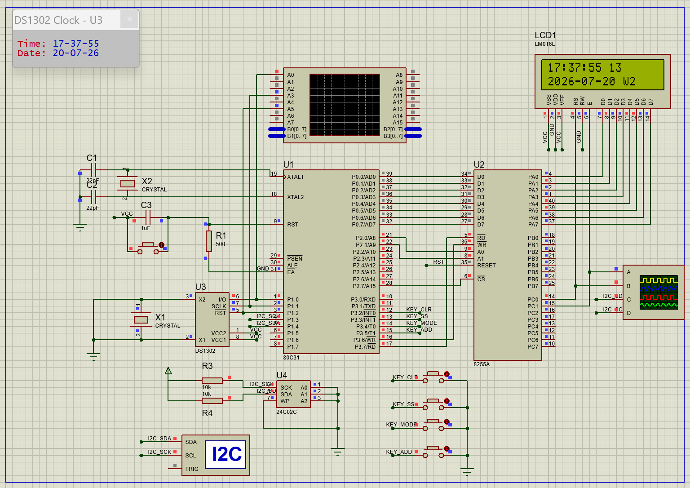

# 基于 8031 的多功能实时钟课程设计

单片机与接口课程设计：使用 8031（80C31）构建的多功能实时钟系统，配合 Proteus 仿真与 Keil C51 开发。

## 功能

- DS1302 实时时钟：显示时、分、秒，以及年月日和星期
- LCD1602 显示，8255A 作为并行接口扩展
- 四按键：清零、启停、设置模式切换和数值调整
- 24C02 EEPROM：保存关键状态，掉电后恢复

## 硬件与工具

| 类别 | 内容 |
| --- | --- |
| 主控 | 8031 / 80C31，6 MHz |
| 外设 | 8255A、LCD1602、DS1302、24C02、四按键 |
| 开发 | Keil C51 |
| 仿真 | Proteus |

## 目录说明

| 路径 | 说明 |
| --- | --- |
| `keil_c/` | Keil C51 主工程与源程序 `c1.c` |
| `Proteus_c/` | Proteus 仿真工程 `实时钟_全功能.pdsprj` |
| `c代码/` | 另一份带有详细注释的 C 源码 |
| `硬件连接框图.*` | 硬件连接与接口说明 |
| `微机接口课设_实时钟_设计报告.*` | 设计报告 |
| `答辩说辞.md` | 答辩准备材料 |

## 使用方法

1. 用 Keil C51 打开 `keil_c/c1.uvproj`，编译生成程序。
2. 用 Proteus 打开 `Proteus_c/实时钟_全功能.pdsprj`。
3. 将 Keil 生成的 HEX 文件加载到仿真中的 8031 器件后运行仿真。

已编译的 HEX 文件位于 `keil_c/Objects/c1.hex`；Proteus 仿真效果如下：

> 仓库不提交 IDE 缓存、Keil 编译产物和 Proteus 自动备份文件；请在本地重新生成。
>
> 为保护隐私，课程过程单、验收单、个人报告和照片等含个人信息的材料仅保留在本地，未包含在本公开仓库中。
